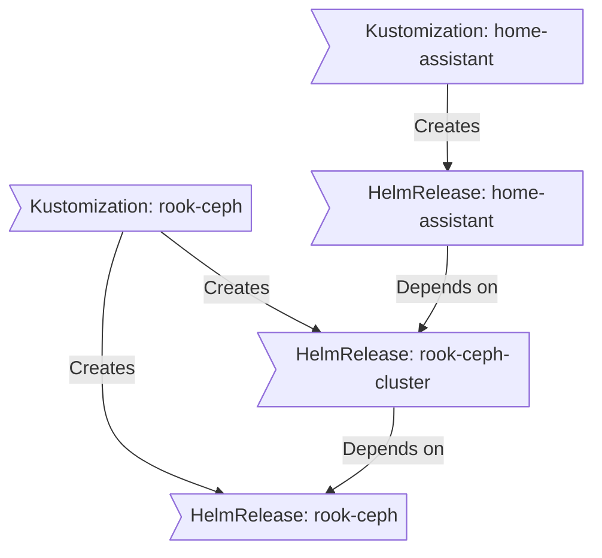

<div align="center">

###  My Home GitOps Repository 

_... managed with Flux, Renovate, and GitHub Actions_ 

</div>

<div align="center">

[](https://discord.gg/home-operations)&nbsp;&nbsp;
[](https://talos.dev)&nbsp;&nbsp;
[](https://kubernetes.io)&nbsp;&nbsp;
[](https://fluxcd.io)&nbsp;&nbsp;
[](https://github.com/dmfrey/home-gitops/actions/workflows/renovate.yaml)

</div>

<!-- div align="center">

[](https://status.dmfrey.com)&nbsp;&nbsp;
[](https://status.dmfrey.com)&nbsp;&nbsp;
[](https://status.dmfrey.com)

</div -->

<div align="center">

[](https://github.com/kashalls/kromgo)&nbsp;&nbsp;
[](https://github.com/kashalls/kromgo)&nbsp;&nbsp;
[](https://github.com/kashalls/kromgo)&nbsp;&nbsp;
[](https://github.com/kashalls/kromgo)&nbsp;&nbsp;
[](https://github.com/kashalls/kromgo)&nbsp;&nbsp;
[](https://github.com/kashalls/kromgo)&nbsp;&nbsp;
[](https://github.com/kashalls/kromgo)

</div>

---

##  Overview

This is a mono repository for my home infrastructure and Kubernetes cluster. I try to adhere to Infrastructure as Code (IaC) and GitOps practices using tools like [Terraform](https://www.terraform.io/), [Kubernetes](https://kubernetes.io/), [Flux](https://github.com/fluxcd/flux2), [Renovate](https://github.com/renovatebot/renovate), and [GitHub Actions](https://github.com/features/actions).


The purpose here is to learn k8s, while practicing Gitops.

---

## ⛵ Kubernetes

My Kubernetes cluster is deployed with [Talos](https://www.talos.dev). This is a semi-hyper-converged cluster, workloads and block storage are sharing the same available resources on my nodes while I have a separate a separate NAS for NFS/SMB shares, bulk file storage and backups.

There is a template over at [onedr0p/cluster-template](https://github.com/onedr0p/cluster-template) if you want to try and follow along with some of the practices I use here.

### Core Components

- **Networking & Service Mesh**: [cilium](https://github.com/cilium/cilium) provides eBPF-based networking, while [envoy](https://gateway.envoyproxy.io/) powers service-to-service communication with L7 proxying and traffic management. [cloudflared](https://github.com/cloudflare/cloudflared) secures ingress traffic via Cloudflare, and [external-dns](https://github.com/kubernetes-sigs/external-dns) keeps DNS records in sync automatically.
- **Security & Secrets**: [cert-manager](https://github.com/cert-manager/cert-manager) automates SSL/TLS certificate management. For secrets, I use [external-secrets](https://github.com/external-secrets/external-secrets) with [1Password Connect](https://github.com/1Password/connect) to inject secrets into Kubernetes, and [sops](https://github.com/getsops/sops) to store and manage encrypted secrets in Git.
- **Storage & Data Protection**: [rook](https://github.com/rook/rook) provides distributed storage for persistent volumes, with [volsync](https://github.com/backube/volsync) handling backups and restores. [spegel](https://github.com/spegel-org/spegel) improves reliability by running a stateless, cluster-local OCI image mirror.
- **Automation & CI/CD**: [actions-runner-controller](https://github.com/actions/actions-runner-controller) runs self-hosted GitHub Actions runners directly in the cluster for continuous integration workflows. For IaC, I use [tofu-controller](https://github.com/flux-iac/tofu-controller) as additional Flux component used to run OpenTofu from within a Kubernetes cluster.

### GitOps

[Flux](https://github.com/fluxcd/flux2) watches the clusters in my [kubernetes](./kubernetes/) folder (see Directories below) and makes the changes to my clusters based on the state of my Git repository.

The way Flux works for me here is it will recursively search the `kubernetes/apps` folder until it finds the most top level `kustomization.yaml` per directory and then apply all the resources listed in it. That aforementioned `kustomization.yaml` will generally only have a namespace resource and one or many Flux kustomizations (`ks.yaml`). Under the control of those Flux kustomizations there will be a `HelmRelease` or other resources related to the application which will be applied.

[Renovate](https://github.com/renovatebot/renovate) watches my **entire** repository looking for dependency updates, when they are found a PR is automatically created. When some PRs are merged Flux applies the changes to my cluster.

### Directories

This Git repository contains the following directories under [Kubernetes](./kubernetes/).

```sh
📁 kubernetes
├── 📁 apps       # applications
├── 📁 components # re-useable kustomize components
└── 📁 flux       # flux system configuration
```

### Flux Workflow

This is a high-level look how Flux deploys my applications with dependencies. In most cases a `HelmRelease` will depend on other `HelmRelease`'s, in other cases a `Kustomization` will depend on other `Kustomization`'s, and in rare situations an app can depend on a `HelmRelease` and a `Kustomization`. The example below shows that `home-assistant` won't be deployed or upgrade until the `rook-ceph-cluster` Helm release is installed or in a healthy state.



---

##  DNS

In my cluster there are two instances of [ExternalDNS](https://github.com/kubernetes-sigs/external-dns) running. One for syncing private DNS records to my `UDM SE` using [ExternalDNS webhook provider for UniFi](https://github.com/kashalls/external-dns-unifi-webhook), while another instance syncs public DNS to `Cloudflare`. This setup is managed by creating ingresses with two specific classes: `internal` for private DNS and `external` for public DNS. The `external-dns` instances then syncs the DNS records to their respective platforms accordingly.

---

##  Hardware

My cluster runs on a variety of energy-efficient hardware.

### 💻 Compute & Storage

| Device          | Manufacturer | Model             | CPU               | RAM   | Role                              |
| --------------- | ------------ | ----------------- | ----------------- | ----- | --------------------------------- |
| `k8s-0`         | GEEKOM       | Mini IT13         | Intel 13th Gen    | 64 GB | Kubernetes Control Plane & Worker |
| `k8s-1`         | GEEKOM       | Mini IT13         | Intel 13th Gen    | 64 GB | Kubernetes Control Plane & Worker |
| `k8s-2`         | GEEKOM       | Mini IT13         | Intel 13th Gen    | 64 GB | Kubernetes Control Plane & Worker |
| `NAS`           | QNAP         | TS-462            | -                 | -     | Network Attached Storage          |

> _Each Kubernetes node has the following disk layout:_
> - **System:** 1x Samsung 870 EVO 1 TB SATA SSD
> - **Ceph:** 1x Silicon Power US75 2 TB NVMe SSD
> - **OpenEBS:** 1x KingSpec NT Series 128GB M.2 2242 SATA SSD
> - **TPU:** 1x Coral M.2 Accelerator with Dual Edge TPU

<details>
  <summary>Click here to see my server rack</summary>

  
</details>

### 🌐 Network & Power

| Device                       | Manufacturer | Model                        | Role                         |
| ---------------------------- | ------------ | ---------------------------- | ---------------------------- |
| Unifi Cable Internet          | Ubiquiti     | UCI                          | Modem                        |
| Dream Machine SE             | Ubiquiti     | UDM SE                       | Core Router & Firewall       |
| Switch Pro Max 24            | Ubiquiti     | USW Pro Max 24               | Core Switch                  |
| Switch Ultra 8               | Ubiquiti     | USW Ultra 8 Port             | Distribution Switch          |
| Switch Flex                  | Ubiquiti     | USW Flex                     | Outdoor Switch               |
| Power Distribution Pro       | Ubiquiti     | UPS PDU Pro                  | Power Distribution           |
| Rackmount UPS                | Ubiquiti     | UPS 2U                       | Uninterruptible Power Supply |
| Redundant Power System       | Ubiquiti     | USP RPS                      | Redundant Power Supply       |
| Cluster UPS                  | Ubiquiti     | UPS Tower                    | Uninterruptible Power Supply |
